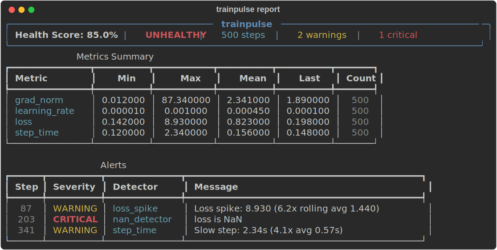
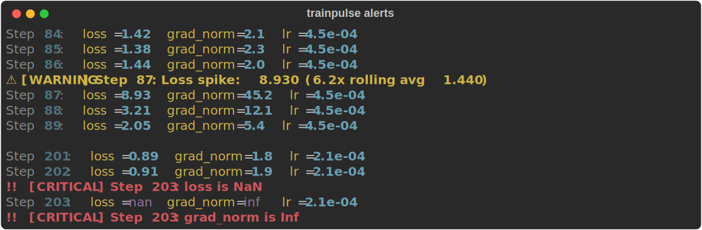

# trainpulse

[](https://pypi.org/project/trainpulse/)
[](https://pypi.org/project/trainpulse/)
[](https://github.com/stef41/trainpulse/actions/workflows/ci.yml)
[](https://www.python.org/downloads/)
[](https://opensource.org/licenses/Apache-2.0)

Lightweight training health monitor. Detect loss spikes, gradient explosions, NaN/Inf, and plateaus — 2 lines of code, no server, no signup.

<p align="center">
  
</p>

## Why trainpulse?

| Feature | W&B / Neptune | TensorBoard | **trainpulse** |
|---|---|---|---|
| Setup | Account + API key | TF dependency | `pip install trainpulse` |
| NaN/Inf detection | Manual | No | **Automatic** |
| Loss spike alerts | Manual | No | **Automatic** |
| Gradient monitoring | Manual | Manual | **Automatic** |
| Plateau detection | No | No | **Automatic** |
| Zero dependencies | No | No | **Yes** |
| Works offline | No | Yes | **Yes** |

## Install

```bash
pip install trainpulse
```

With PyTorch integration:

```bash
pip install trainpulse[torch]
```

With CLI:

```bash
pip install trainpulse[cli]
```

## Quick Start

### Minimal — 2 lines

```python
from trainpulse import Monitor

monitor = Monitor()
for step in range(num_steps):
    loss = train_step()
    monitor.log("loss", step, loss)

report = monitor.report()
print(f"Health: {report.health_score:.0%}")
```

### Full training loop

```python
from trainpulse import Monitor, MonitorConfig

config = MonitorConfig(
    loss_spike_threshold=5.0,    # Alert if loss > 5x rolling average
    grad_norm_threshold=100.0,   # Alert if gradient norm > 100
    plateau_patience=200,        # Alert after 200 steps without improvement
)

monitor = Monitor(config)

for step in range(num_steps):
    monitor.step_start()

    loss = train_step()
    grad_norm = get_grad_norm()
    lr = scheduler.get_last_lr()[0]

    monitor.log("loss", step, loss)
    monitor.log("grad_norm", step, grad_norm)
    monitor.log("learning_rate", step, lr)
    monitor.step_end(step)

report = monitor.report()
```

### Callback API

```python
from trainpulse import TrainingCallback

cb = TrainingCallback()
for step in range(num_steps):
    cb.on_step_begin(step)
    loss = train_step()
    cb.on_step_end(step, loss=loss, grad_norm=grad_norm, lr=lr)

report = cb.report()
```

### Real-time alerts

```python
def my_alert_handler(alert):
    print(f"⚠ {alert}")
    # Or send to Slack, Discord, email...

config = MonitorConfig(alert_callbacks=[my_alert_handler])
monitor = Monitor(config)
```

<p align="center">
  
</p>

## Detectors

| Detector | What it catches | Default threshold |
|---|---|---|
| **NaN/Inf** | NaN or Inf in any metric | Always on |
| **Loss spike** | Sudden loss increase vs rolling average | 5x |
| **Gradient explosion** | Gradient norm too large | 100.0 |
| **Gradient vanishing** | Gradient norm too small | 1e-7 |
| **LR anomaly** | Learning rate jumps | 10x change |
| **Plateau** | No loss improvement | 100 steps |
| **Step time** | Unusually slow steps | 3x average |

## CLI

Analyze training logs (JSONL format):

```bash
trainpulse analyze train.jsonl
trainpulse analyze train.jsonl --json-out report.json
trainpulse show report.json
```

Expected JSONL format:
```json
{"step": 0, "loss": 2.5, "grad_norm": 1.2, "learning_rate": 0.001}
{"step": 1, "loss": 2.3, "grad_norm": 1.1, "learning_rate": 0.001}
```

## Health Score

The health score (0.0–1.0) is computed from alert severity:

- **Critical** alerts (NaN, gradient explosion): −0.15 each
- **Warning** alerts (spikes, plateaus): −0.05 each
- **Info** alerts: −0.01 each

A score above 0.80 generally indicates healthy training.

## API Reference

### `Monitor(config=None)`

Main class. Call `.log(name, step, value)` to record metrics.

### `MonitorConfig`

| Parameter | Default | Description |
|---|---|---|
| `loss_spike_threshold` | 5.0 | Multiplier over rolling average |
| `loss_spike_window` | 50 | Rolling window size |
| `grad_norm_threshold` | 100.0 | Max acceptable gradient norm |
| `grad_vanish_threshold` | 1e-7 | Min acceptable gradient norm |
| `check_nan` | True | Enable NaN/Inf detection |
| `lr_change_threshold` | 10.0 | Max LR change ratio per step |
| `plateau_patience` | 100 | Steps without improvement |
| `plateau_min_delta` | 1e-5 | Minimum improvement delta |
| `step_time_spike_threshold` | 3.0 | Step time spike multiplier |
| `alert_callbacks` | [] | Functions called on each alert |

### `TrainingReport`

| Property | Type | Description |
|---|---|---|
| `.health_score` | float | 0.0 (terrible) to 1.0 (perfect) |
| `.is_healthy` | bool | True if no critical alerts |
| `.n_warnings` | int | Number of warning alerts |
| `.n_critical` | int | Number of critical alerts |
| `.alerts` | list[Alert] | All triggered alerts |
| `.metrics_summary` | dict | Per-metric min/max/mean/last |

## See Also

Part of the **stef41 LLM toolkit** — open-source tools for every stage of the LLM lifecycle:

| Project | What it does |
|---------|-------------|
| [tokonomics](https://github.com/stef41/tokonomix) | Token counting & cost management for LLM APIs |
| [datacrux](https://github.com/stef41/datacruxai) | Training data quality — dedup, PII, contamination |
| [castwright](https://github.com/stef41/castwright) | Synthetic instruction data generation |
| [datamix](https://github.com/stef41/datamix) | Dataset mixing & curriculum optimization |
| [toksight](https://github.com/stef41/toksight) | Tokenizer analysis & comparison |
| [ckpt](https://github.com/stef41/ckptkit) | Checkpoint inspection, diffing & merging |
| [quantbench](https://github.com/stef41/quantbenchx) | Quantization quality analysis |
| [infermark](https://github.com/stef41/infermark) | Inference benchmarking |
| [modeldiff](https://github.com/stef41/modeldiffx) | Behavioral regression testing |
| [vibesafe](https://github.com/stef41/vibesafex) | AI-generated code safety scanner |
| [injectionguard](https://github.com/stef41/injectionguard) | Prompt injection detection |

## License

Apache-2.0
